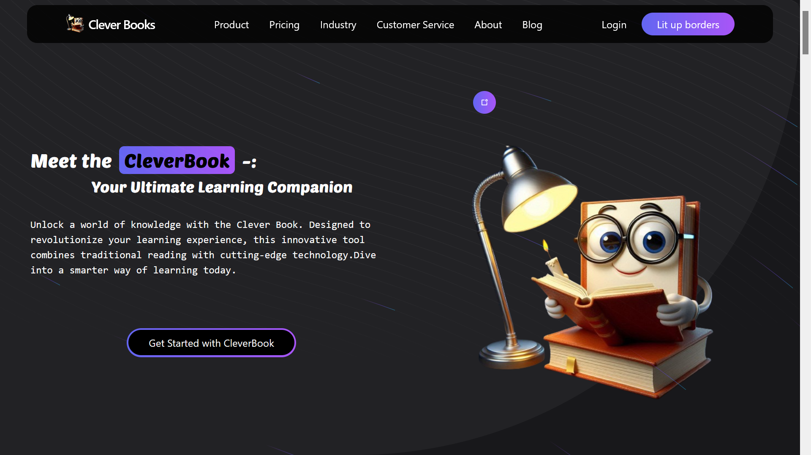

# CleverBook

This project is an online reading website built using Vite, React, Acertinity UI, Tailwind CSS, and Framer Motion. It allows users to explore and read online content. The project is deployed on Netlify.

## screenshots



## Features

- Smooth animations using Framer Motion
- Responsive design with Acertinity UI and Tailwind CSS

## Getting Started

1. **Clone the repository:**

   ```bash
   git clone https://github.com/07kundan/cleverBooks.git
   cd cleverBooks
   ```

2. **Install dependencies:**

   ```bash
   npm install
   ```

3. **Run the development server:**

   ```bash
   npm run dev
   ```

4. **Open your browser and navigate to http://localhost:5173**

## Deployment

The project is automatically deployed to Netlify whenever changes are pushed to the `main` branch. You can access the live website at `https://cleverbook.netlify.app/`.

## Contributing

Contributions are welcome! If you'd like to contribute, please follow these steps:

1. Fork the repository.
2. Create a new branch: `git checkout -b feature/your-feature-name`.
3. Make your changes and commit them: `git commit -m "Add your feature"`.
4. Push to the branch: `git push origin feature/your-feature-name`.
5. Create a pull request.
